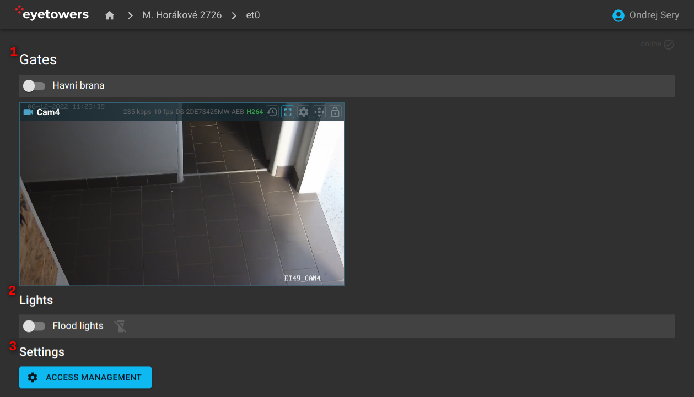

# Přístup

Stránka přehledu přístupu obsahuje seznam ovládatelných přístupových bodů, např. brána, vrata, dveře
s ovládacím prvkem pro jejich otevření/zavření (1). Tam kde jsou přítomny, se zobrazí i kamery
zabírající daný vstup. Dále zde lze ovládat osvětlení jednotky pro zlepšení viditelnosti (2). Pokud
je aktivován, je zde i odkaz na administrativní rozhraní samotného přístupového systému (3).

