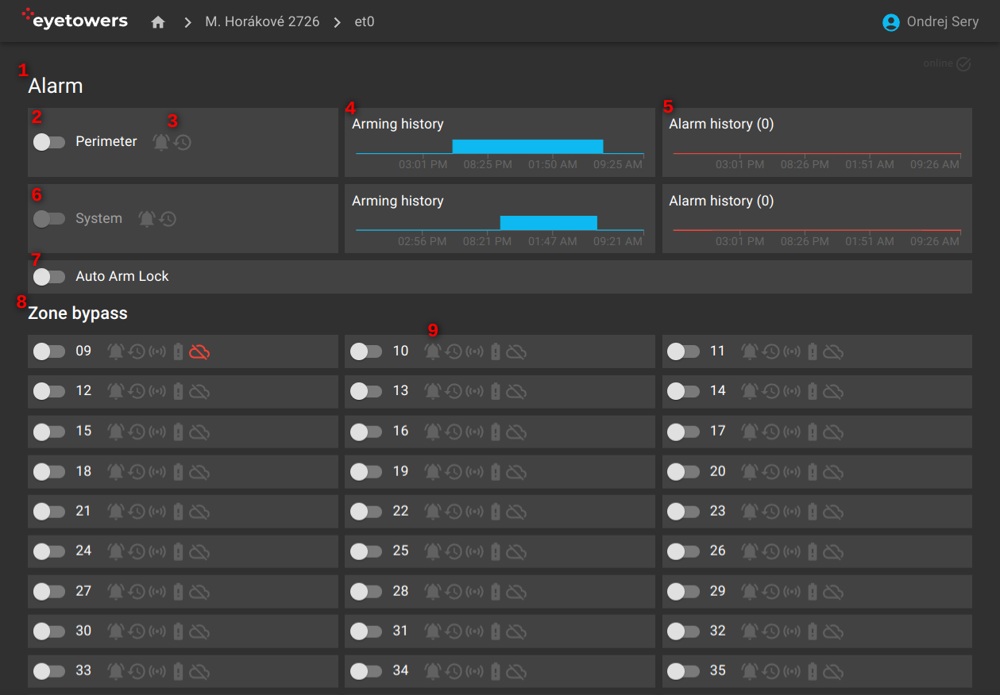

# Alarm

Stránka alarmu obsahuje jednak ovládání alarmu celé jednotky (1) dále pak detailní přehled zón a
bypasů (8).

Nejdůležitější je zde funkce aktivace a deaktivace ochrany perimetru (2) s indikátory aktivního
poplachu a poplachu v historii, tj. poplachu od poslední aktivace ochrany (3). Grafy vpravo pak
shrnují historii aktivace ochrany (4) a poplachů (5) za posledních 24 hodin.

Podobné prvky jsou zde i pro systém jednotky, tedy ochrana jednotky jako takové (6). Tyto ovládací
prvky má typický uživatel neaktivní.

"Auto-Arm Lock" pak aktivuje/deaktivuje automatickou ochranu podle přednastaveného rozvrhu (7).

Druhá sekce (8) obsahuje ovládací prvky pro bypass zón. Každé bezdrátové čidlo většinou odpovídá
jedné zóně. Pro každou zónu tu pak jsou indikátory (9): aktivního poplachu, poplachu v historii,
aktuálního narušení zóny, stavu baterie, a stavu spojení řídící jednotky s čidlem, např.
signalizuje, že je čidlo příliš daleko od jednotky samotné.

