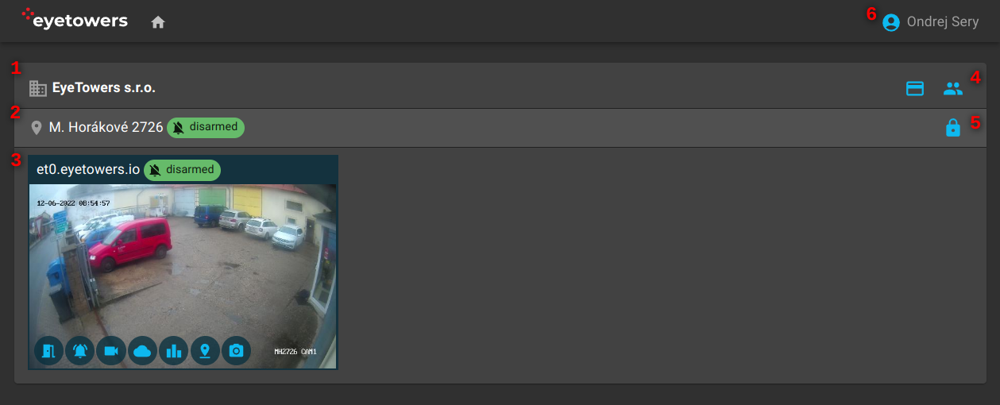

# Portál

Webový Portál [portal.eyetower.io](https://portal.eyetowers.io/) je centrální místo pro věškerou
práci s produkty EyeTowers.

## Úvodní stránka

Po přihlášení do Portálu se dostanete na úvodní stránku, která shrnuje organizace (1), lokality (2),
a jednotky (3), ke kterým máte přístup.

U organizací, kterých je přihlášený uživatel administrátor, se navíc aktivují volby pro správu
uživatelů a identifikátorů (4).

Na úrovni lokací je zvýrazněna indikace aktivovaného `armed`, deaktivovaného `disarmed`, nebo
částečně aktivovaného `partial` alarmu celé lokality. Uživatelé s odpovídajícím oprávněním mohou
kliknutím na indikátor alarm aktivovat nebo deaktivovat pro celou lokalitu (tj. na všech
jednotkách). Administrátor má navíc aktivní volbu pro správu uživatelských oprávnění pro tuto
lokalitu (5).

Indikace alarmu je přítomna i na každé jednotce (3) a i tam ho lze, pokud má uživatel odpovídající
oprávnění, kliknutím aktivovat nebo deaktivovat. Ikony vespod náhledu jednotky pak vedou na
jednotlivé nabízené služby:

- Přístup
- Alarm
- Video
- Počasí
- Statistiky
- Poloha
- Časosběr

Barva ikony služby pak indikuje:

- Modrá: služba je na jednotce aktivovaná a uživatel má na loklitě oprávnění službu použít.
- Červená: služba je na jednotce aktivovaná, ale uživatel nemá oprávnění službu použít.
- Šedá: služba na jednotce není aktivovaná.
