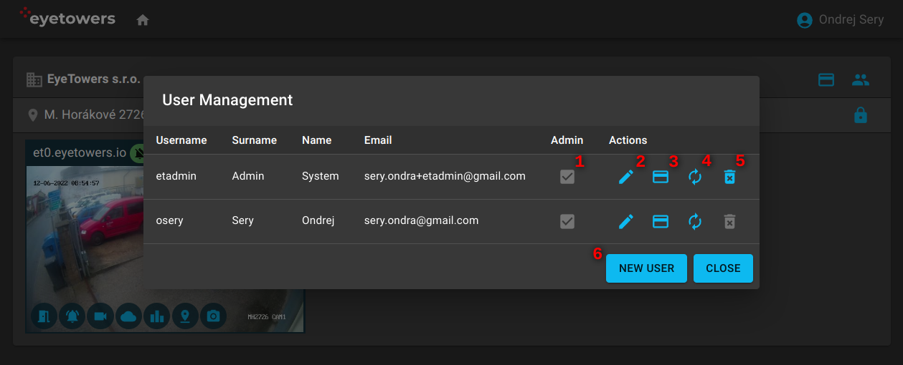

# Portál

Webový Portál [portal.eyetower.io](https://portal.eyetowers.io/) je centrální místo pro věškerou
práci s produkty EyeTowers.

## Úvodní stránka

Po přihlášení do Portálu se dostanete na úvodní stránku, která shrnuje organizace (1), lokality (2),
a jednotky (3), ke kterým máte přístup.

U organizací, kterých je přihlášený uživatel administrátor, se navíc aktivují volby pro
[správu uživatelů](#správa-uživatelů) a identifikátorů (4).

Na úrovni lokací je zvýrazněna indikace aktivovaného `armed`, deaktivovaného `disarmed`, nebo
částečně aktivovaného `partial` alarmu celé lokality. Uživatelé s odpovídajícím oprávněním mohou
kliknutím na indikátor alarm aktivovat nebo deaktivovat pro celou lokalitu (tj. na všech
jednotkách). Administrátor má navíc aktivní volbu pro správu
[uživatelských oprávnění](#uživatelská-oprávnění) pro tuto lokalitu (5).

Indikace alarmu je přítomna i na každé jednotce (3) a i tam ho lze, pokud má uživatel odpovídající
oprávnění, kliknutím aktivovat nebo deaktivovat. Ikony vespod náhledu jednotky pak vedou na
jednotlivé nabízené služby:

- [Přístup](/cs/access.md)
- [Alarm](/cs/alarm.md)
- [Video](/cs/video.md)
- Počasí
- Statistiky
- Poloha
- Časosběr

Barva ikony služby pak indikuje:

- Modrá: služba je na jednotce aktivovaná a uživatel má na loklitě oprávnění službu použít.
- Červená: služba je na jednotce aktivovaná, ale uživatel nemá oprávnění službu použít.
- Šedá: služba na jednotce není aktivovaná.

## Správa uživatelů

Pouze administrátor organizace může spravovat její uživatele. Dialog správy uživatelů obsahuje
jejich seznam s indikací administrátora (1) a akcemi pro editaci uživatele (2), editaci
identifikátorů, např. čipová karta či telefon (3), reset hesla (4) a nevratné smazání uživatele (5).
Dále je zde možnost přidání nového uživatele (6).

Nový uživatel je identifikován uživatelským jménem (1) a emailem (4). Obě tyto hodnoty musí být
unkátní pro celý systém. Po přidání do systému administrátorem uživateli přijde email na zadanou
emailovou adresu s odkazem na nastavení hesla do systému. Platnost odkazu je časově omezena. Pokud
platnost vyprší, lze použít funkci "reset hesla" pro vygenerování nového emailu s platným odkazem.

Nezapomeňte novým uživatelům take přidat [oprávnění](#uživatelská-oprávnění) k lokalitám, se kterymi
potřebují pracovat. V opačném případě nový uživatel bez přidaných oprávnění žadné lokality nevidí.

## Uživatelská oprávnění

Administrátor určuje oprávnění uživatelů ke službám v lokalitách organizací, které spravuje.

Okno pro správu oprávnění ke službám v dané lokalitě obsahuje v řádcích seznam uživatelů organizace
s indikací zda jde o administrátora (1) a zda danou lokalitu se svými aktualními oprávněními vubec
vidí (2). Jednotlivé sloupce pak odpovídají oprávněním ke službám v dané lokalitě:
[přístup](/cs/access.md) (3), [alarm](/cs/alarm.md) (4), [video](/cs/video.md#video) (5),
[archiv](/cs/video.md#videoarchiv) (6), statistiky (7), poloha (8) a časosběr (9). Zjednodušeně
řečeno, čím zelenější barva, tím silnější oprávnění.
