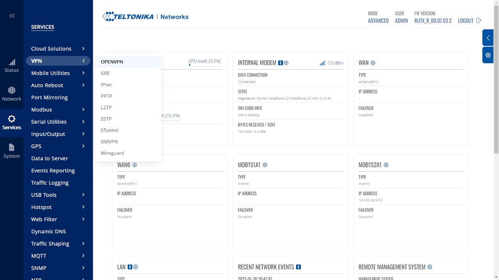
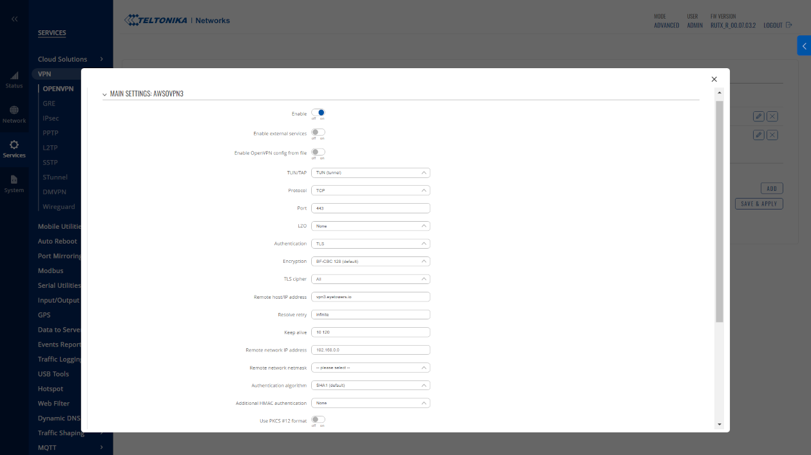

# Portál

Nastavení technických parametrů síťových směrovačů pro připojení věží třetích stran a nebo pevných kamerových systémů k cloudu EyeTowers.

Obecně je pro připojení systémů třetích stran ke cloudu EyeTowers potřeba zabezpečené připojení k jednomu z hostovaných VPN serverů. Pro připojení využíváme OpenVPN. Po zprovoznění je potřeba nastavit přesměrování portů (NAT) na lokální adresy koncových prvků. 

## Teltonika
### RUTXxx

services->VPN->OPENVPN->ADD NEW INSTANCE (role client)
TUN/TAP: TUN (tunnel)
protocol: TCP
port: 443
LZO: none
Authentication: TLS
Encryption: BF-CBC 128 (default)
TLS cipher: All
Remote host/IP address: vpn3.eyetowers.io
Resolve retry: infinite
Keep alive: 10 120
Remote network IP address: --
Remote network netmask: --
Authentication algorithm: SHA1 (default)
Additional HMAC authentication: None
Use PKCS #12 format: off
Extra options: --
Certificate authority: ca.crt
Client certificate: client.crt
Client key: client.key

