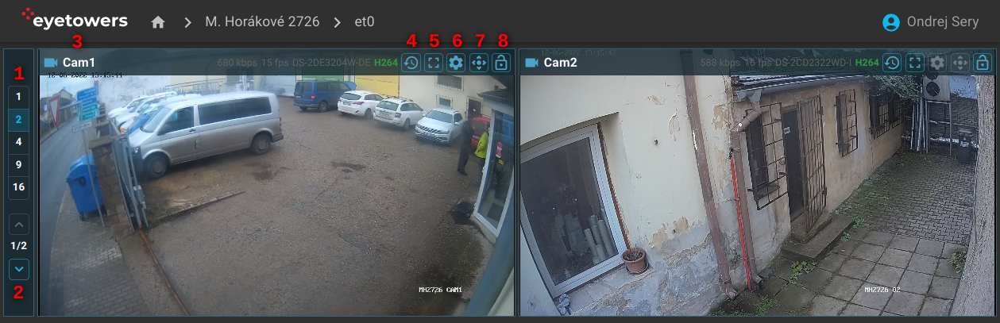
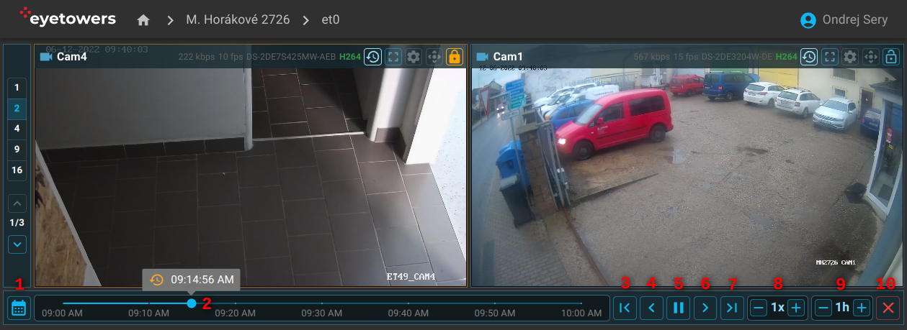

# Video

Stránka videa obsahuje živý pohled na kamery zvolené jednotky. Podle velikosti displeje zařízení lze
na jedné stránce zobrazit 1 až 16 kamer (1) a mezi strankami pak přepínat pomocí šipek na klávesnici
nebo ovládacích prvků s šipkami (2).

Každá kamera je opatřena hlavičkou (3) s jejím názvem a informacemi o kvalitě video kanálu:

- Datový tok v Kb za vteřinu, `kbps`.
- Počet snímků za vteřinu, `fps`.
- Seriové číslo kamery.
- Stav/typ streamu, ideálně zelené `H264`.

Najetím kurzoru nad název kamery lze zobrazit další informace: rolišení, výrobce a model kamery.

V pravé části hlavičky jsou pak tlačítka k rozšířenému ovládání kamer. Některé z nich můžou být
neaktivní pokud kamera danou funkci neumožňuje nebo pokud uživatel postrádá oprávnění k jejich
použití.

Zleva do prava to jsou:

- Vstup do [video archivu](#videoarchiv) (4).
- Zobrazit danou kameru přes celou obrazovku (5). Některá zařízení s iOS tento režim neumožňují.
- Zobrazit pokročilá nastavení kamery, např., ovládání a nastavování presetů, IR přísvitu, atd (6).
- Zobrazit ovládací prvky PTZ, šipky a virtuální joystick (7).
- Dočasně uzamknout danou kameru na stránce (8). Při stránkování tak vybraná kamera nebo více kamer
  zůstávají vidět a obměnují se pouze kamery na zbylých pozicích.

Kliknutím do obrazu kamery danou kameru zvětšíte do samostatného okna a opětovným kliknutím zase
zmenšíte.

## Videoarchiv

V režimu videoarchivu je možné procházet uložený video záznam synchronizovaně na více kamerách
zároveň.

Přesný čas lze buď vybrat s pomocí kalendáře (1) nebo použitím časové osy (2). Rozlišení časové osy
lze zvolit od 10 minut až po jeden celý den (9). Tlačítky (3) a (7) lze záznam posunout o celou
délku časové osy dozadu (3) či dopředu (7). Tlačítky (4) a (6) pak o 30 vteřin. Tlačítko (5) slouží
k pozastavení a opětovnému spuštění přehrávání záznamu. Rychlost přehrávání lze zvolit mezi 1/2x až
32x volbou (8). Režim videoarchivu ukončíte tlačítkem (10), které stránku přepne do živého pohledu.

