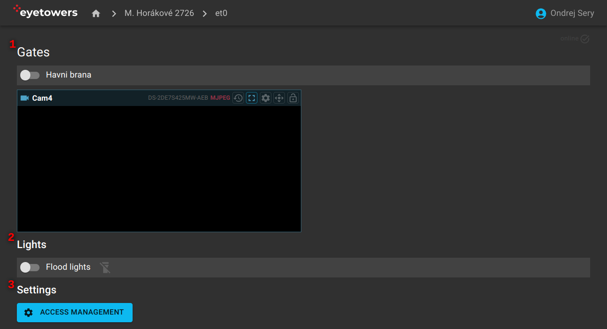

# Access

The access overview page contains the list of entrances, e.g., a gate or a door, with a control
element that allows to open/close them (1). Where present, the list also views camera(s) pointed at
the entrance. It is also possible to control the unit flood lights here (2). If activated, there is
also a link to the actual access management system (3).

