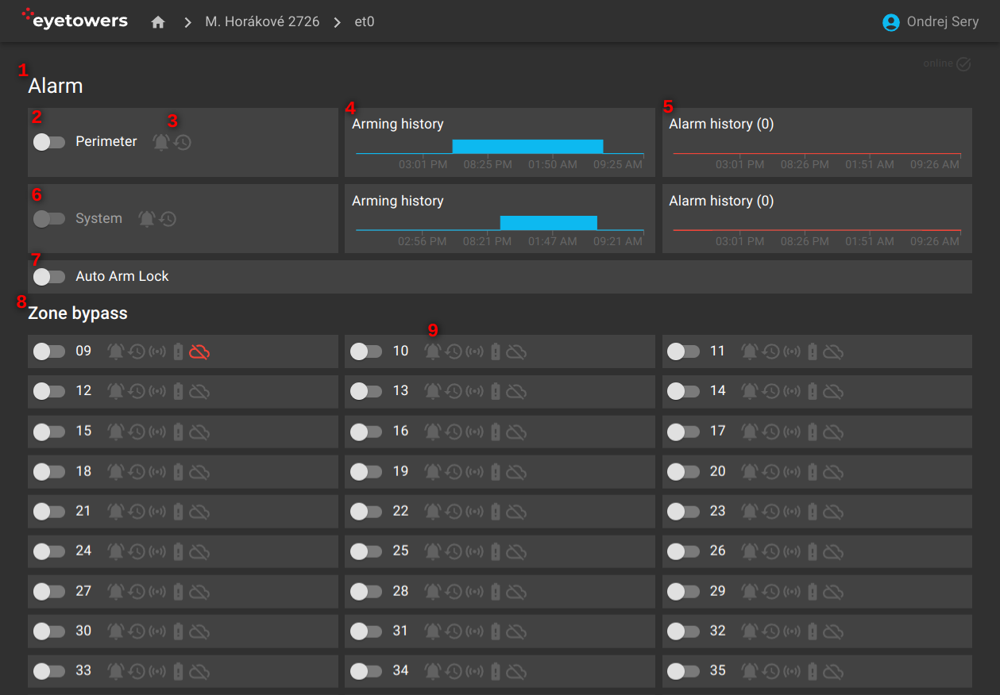

# Alarm

The alarm overview page contains both controls for the entire unit (1) and detailed overview of
zones and their bypasses (8).

The most important functionality is arming and disarming perimeter alarm (2) with indicators of
active alarm and alarm in history, i.e., an alarm since the last alarm activation (3). Charts on the
right summarize the history of alarm activation state (4) and actual alarms (5) over the last 24
hours.

There are also corresponding controls for the unit system itself, i.e., protection of the unit as
such (6). These controls are disabled for a typical user.

The Auto-Arm Lock activates/deactivates automatic arming based on a preset schedule (7).

The second section (8) contains controls for zone bypasses. Usually, each wireless detector is
represented as a single zone. For each zone, there are indicators (9) for: active alarm, alarm in
history, current zone violation, state of the battery, and the connection state, which, e.g.,
signals that the detector is too far from the unit itself.

