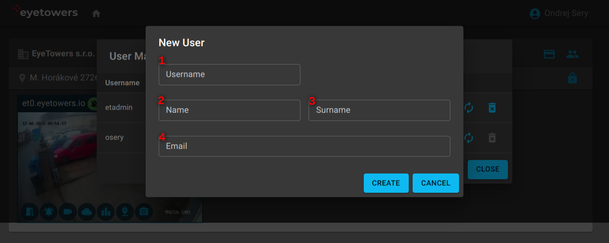

# Portal

Web Portal [portal.eyetower.io](https://portal.eyetowers.io/) is the central hub for all
interactions with EyeTowers products.

## Overview Page

After logging into Portal, you get to an overview page, which lists organizations (1), sites (2),
and units (3) that you have granted access to.

Organizations that the user administers have the option for managing user and identifiers enabled
(4).

On the level of sites, there is an indicator of the alarm state for the entire site as either
`armed`, `disarmed`, or `partial`. Users that have been granted the corresponding permission change
the alarm state for the entire site (i.e., for all the units) by clicking on the indicator. In
addition, an administrator has the option to manage user permissions for the site (5).

Alarm state indicator is also present for each unit (3) and users with the necessary permission can
also click it arm or disarm the alarm for the single unit. Icons on the bottom of the unit preview
lead to the individual offered services:

- Access
- Alarm
- Weather
- Statistics
- Tracking
- Timelapse

Color of the icon indicates:

- Blue: the service is subscribed and the user has the necesasry site permissions to use it.
- Red: the service is subscribed, but the user lacks the necesasry site permissions to use it.
- Grey: the service is not subscribed.

## User Management

Only the administrator of an organization can manage its users. The user management dialog lists
user of the organization with an indication of admin users (1) and actions for user editing (2),
identifier editing, e.g., an access card or a phone number (3), password reset (4), and permanent
user deletion (5). There is also an option to add new users to the organization (6).

A new user is identified by their username (1) and email (4). Both these values must be unique for
the entire system. After an admin adds a user, they receive an email with a link for setting their
system password. The link validity is limitted. Should it expire, the "password reset" can be used
to generate a new email with a valid link.

