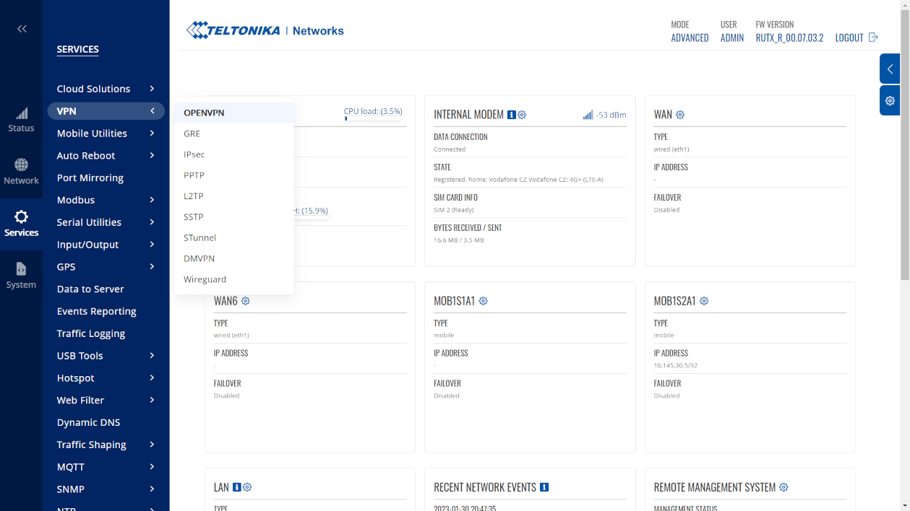

# Technical documentation

Setting technical parameters of network routers for connecting third-party towers or fixed camera systems to the EyeTowers cloud.

A secure connection to one of hosted VPN servers is required to connect third-party systems to the EyeTowers cloud. We use OpenVPN, please contact us to obtain tls certificates. Once up and running, port forwarding (NAT) needs to be set up to the local addresses of cameras etc.

## Teltonika
### RUTXxx

Services->VPN->OPENVPN->ADD NEW INSTANCE (role client)

- TUN/TAP: TUN (tunnel)
- protocol: TCP
- port: 443
- LZO: none
- Authentication: TLS
- Encryption: BF-CBC 128 (default)
- TLS cipher: All
- Remote host/IP address: vpn3.eyetowers.io
- Resolve retry: infinite
- Keep alive: 10 120
- Remote network IP address: --
- Remote network netmask: --
- Authentication algorithm: SHA1 (default)
- Additional HMAC authentication: None
- Use PKCS #12 format: off
- Extra options: --
- Certificate authority: ca.crt
- Client certificate: client.crt
- Client key: client.key

